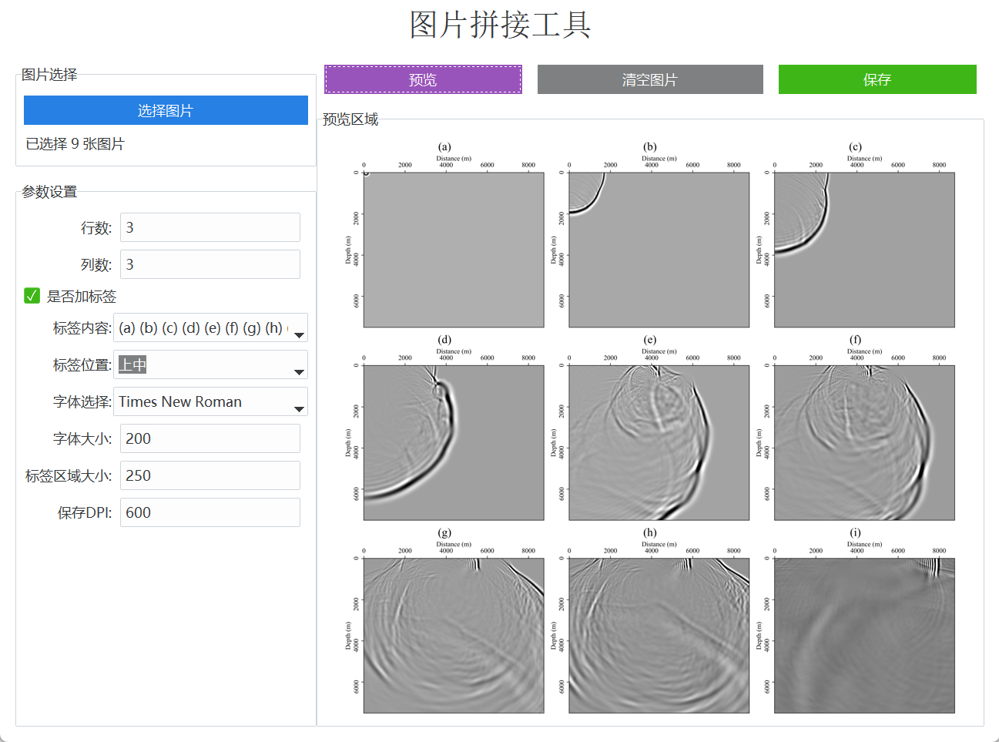

# Imageweaver

# ImageWeaver

> 科研图片拼接工具 · Scientific Image Grid Stitching Tool

---

## 📌 项目简介

**ImageWeaver** 是一款面向科研图像处理场景的小型拼接工具，  
可以快速将多张图片按照指定的行列数排版拼接，并支持添加标签、字体设置、DPI自定义保存等功能。  
界面简洁，操作直观，适合论文插图、科研报告制作等场景。

本工具采用 **Python + Tkinter + ttkbootstrap** 开发，已打包为 `.exe` 可执行文件，  
**无需安装 Python 或任何第三方库，双击即可运行！**

---


## ✨ 示例截图

> 下图为程序运行界面示意（仅供参考）



---

## 🚀 功能特色

- 批量导入多张图片
- 自定义行列排布
- 自动统一图片尺寸
- 支持添加标签（a, b, c...）
- 标签字体、大小、位置可自定义
- 支持保存高DPI（论文投稿）
- 图片预览与顺序拖拽调整
- 简洁美观的用户界面（基于 ttkbootstrap）

---


## 📦 下载与使用

### 直接使用 `.exe` 可执行文件

1. 打开 [`release/`](./release) 文件夹
2. 下载最新版本的 `ImageWeaver.exe`
3. 双击运行（仅限 Windows 64位）

无需安装环境，无需安装Python，无需安装任何库！

### 自行运行 Python 源代码（可选）

如果希望查看或自定义源代码，可以按如下步骤操作：

1. 安装依赖

```bash
pip install ttkbootstrap pillow
```

2. 运行程序

```bash
python ImageWeaver.py
```

## 🛠 项目结构

```plaintest
ImageWeaver/
├── release/                  # 打包好的可执行文件
│   └── ImageWeaver.exe
├── assets/                    # 示例截图文件夹
│   └── preview.png            # 程序预览图
├── ImageWeaver.py             # 主程序源代码
├── icon.ico                   # 程序图标
├── README.md                  # 本说明文档
└── ...（其他辅助文件）
```

## 🤝 贡献

欢迎提出建议与反馈！

- 提交 Issue：报告Bug或提出功能建议
- 提交 Pull Request：欢迎优化或扩展功能

## 📄 License

本项目基于 **MIT License** 进行开源发布。

请自由使用、学习、修改本项目内容。若在项目中引用，烦请注明出处，谢谢！

> Developed by Jiazan Wang | 2025
